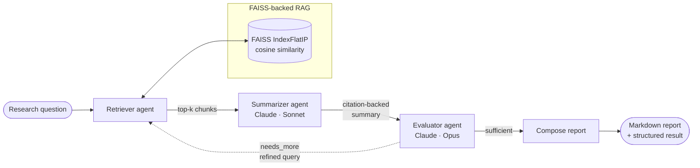

# Agentic Research Assistant — Multi-Agent Academic Discovery

> A multi-agent system (Claude + LangGraph: **retriever**, **summarizer**, **evaluator**) that autonomously reads and synthesizes research papers over a **FAISS-backed RAG pipeline**, producing **citation-backed** summaries and extracting **methods**, **key findings**, and **research gaps**.

[](https://github.com/bharathkumardev1/agentic-research-assistant/actions/workflows/ci.yml)


---

## Overview

Reading a stack of papers to answer one focused question is slow, and a single LLM call over a pile of PDFs tends to hallucinate and skip the parts that matter. This project treats the task the way a careful researcher would — retrieve the relevant passages, draft a grounded synthesis, **critique it**, and go back for more evidence if the answer is thin — and wires that loop together as a small team of cooperating agents.

Three agents share one FAISS vector store:

- **Retriever** — pulls the most relevant chunks for the current query.
- **Summarizer** — asks Claude for a structured synthesis where *every claim carries a `[n]` citation* tied to a retrieved passage.
- **Evaluator** — a second Claude call that judges grounding and coverage, and either approves the answer or hands back a **refined query** to run another round.

A [LangGraph](https://langchain-ai.github.io/langgraph/) state machine orchestrates the retrieve → summarize → evaluate loop and decides when the answer is good enough to stop.

### Runs out of the box, offline

Every component has a dependency-free fallback, so you can watch the whole agent loop run **with no API key and no model download**:

```bash
pip install -e .
python -m research_assistant demo --dry-run
```

`--dry-run` swaps in deterministic **hashing embeddings** and a **stub Claude client** that fabricates plausibly structured output from the retrieved text. It exercises the real retrieval, the real graph, the real citation alignment, and the real report renderer — just without the network. Drop in an `ANTHROPIC_API_KEY` and remove the flag to get genuine Claude synthesis.

---

## Architecture



The conditional edge after **evaluate** is what makes the system *agentic* rather than a fixed pipeline: the evaluator's verdict (`sufficient` vs `needs_more`) routes control flow, and the loop is bounded by `max_iterations` so it always terminates.

```
            ┌──────────────────────── retrieve ◄───────────────────┐
            │                            │                          │
   START ───┘                            ▼                          │ needs_more
                                     summarize                      │ + refined_query
                                         │                          │ + budget left
                                         ▼                          │
                                     evaluate ──────────────────────┘
                                         │
                                         │ sufficient  /  budget spent
                                         ▼
                                     compose ───► END
```

### Ingestion → retrieval → synthesis

```
PDFs / .txt / .md / arXiv
        │  loaders.py
        ▼
   boundary-aware chunker (chunking.py)
        │  chunk_size + overlap, respects paragraph/sentence boundaries
        ▼
   embeddings (embeddings.py)  ──►  FAISS IndexFlatIP  (vector_store.py)
        sentence-transformers (default)        │
        or hashing fallback (offline)          ▼
                                       numbered context block (context.py)
                                               │  [1] [2] [3] aligned with bibliography
                                               ▼
                                    summarizer ─► evaluator ─► report (report.py)
```

---

## Features

- **Three-agent LangGraph loop** with a real reflect-and-retry cycle, not a linear chain.
- **Citation-backed synthesis** — inline `[n]` markers are generated against numbered sources and reconciled with the rendered bibliography, so every claim is traceable to a passage.
- **Structured extraction** into `summary`, `methods`, `key_findings`, and `research_gaps`, validated with Pydantic at the LLM boundary.
- **FAISS RAG** using `IndexFlatIP` over L2-normalized vectors (so inner product *is* cosine similarity), with save/load persistence.
- **Pluggable embeddings** — high-quality `sentence-transformers` by default, with a deterministic dependency-free **hashing** backend for offline use.
- **Fully offline `--dry-run` mode** — no API key, no downloads, runs the entire graph end to end.
- **Multiple sources** — local PDFs / text / Markdown, or fetch straight from **arXiv**.
- **Robustness** — lazy imports of heavy deps, retry-with-backoff on transient API errors, graceful JSON extraction from model output.
- **Typed throughout**, with a focused test suite and CI.

---

## How it works

1. **Ingest.** Documents are loaded and split by a boundary-aware chunker that prefers paragraph → sentence → word breaks and keeps a configurable overlap so context isn't severed mid-thought. Each chunk is embedded and added to a FAISS index.
2. **Retrieve.** For the current query the retriever returns the top-k chunks by cosine similarity. Across loop iterations, newly retrieved chunks are merged with earlier ones (deduped by id, best score kept).
3. **Summarize.** The retrieved chunks are rendered into a numbered context block. Claude is prompted to answer using *only* those sources and to attach `[n]` markers to every factual sentence; the JSON response is validated into a `PaperSummary`.
4. **Evaluate.** A second Claude call scores grounding and coverage and decides `sufficient` vs `needs_more`. If more is needed (and budget remains), it emits a `refined_query` and the graph loops back to retrieval.
5. **Compose.** Once the evaluator is satisfied or the iteration budget is spent, the run is rendered to a Markdown report with the summary, the three extracted lists, the evaluation, the search trail, and a numbered reference list.

---

## Project structure

```
agentic-research-assistant/
├── src/research_assistant/
│   ├── config.py              # Settings (env / .env), model + RAG knobs
│   ├── schemas.py             # Pydantic models shared across the system
│   ├── llm.py                 # Claude client (+ retries) and offline stub
│   ├── context.py             # Numbered context block ↔ citation alignment
│   ├── report.py              # Markdown report renderer
│   ├── factory.py             # Composition root (wires everything together)
│   ├── cli.py                 # `research-assistant` command-line interface
│   ├── __main__.py            # `python -m research_assistant`
│   ├── ingestion/
│   │   ├── loaders.py         # PDF / text / Markdown / arXiv loaders
│   │   └── chunking.py        # Boundary-aware overlapping chunker (stdlib)
│   ├── rag/
│   │   ├── embeddings.py      # sentence-transformers + hashing backends
│   │   └── vector_store.py    # FAISS IndexFlatIP store with persistence
│   ├── agents/
│   │   ├── retriever.py       # Retriever agent
│   │   ├── summarizer.py      # Summarizer agent (prompt + validation)
│   │   └── evaluator.py       # Evaluator agent (drives the loop)
│   └── graph/
│       ├── state.py           # Typed LangGraph state
│       └── workflow.py        # Graph topology + ResearchPipeline facade
├── tests/                     # Unit + offline end-to-end tests
├── examples/sample_papers/    # Three synthetic papers for the demo
├── pyproject.toml
├── requirements.txt
├── Makefile
├── .env.example
└── .github/workflows/ci.yml
```

---

## Installation

Requires **Python 3.9+**.

```bash
git clone https://github.com/your-username/agentic-research-assistant.git
cd agentic-research-assistant

python -m venv .venv && source .venv/bin/activate      # optional but recommended
pip install -e .                                        # or: pip install -e ".[dev]"
```

This installs the console script `research-assistant` (equivalent to `python -m research_assistant`).

> **Note on FAISS:** `faiss-cpu` ships prebuilt wheels for most platforms. If installation fails on yours, see the [FAISS install guide](https://github.com/facebookresearch/faiss/blob/main/INSTALL.md).

---

## Configuration

Configuration is read from environment variables or a `.env` file. Copy the template and add your key:

```bash
cp .env.example .env
# edit .env and set ANTHROPIC_API_KEY
```

| Variable | Default | Purpose |
|---|---|---|
| `ANTHROPIC_API_KEY` | — | Required for live runs (not for `--dry-run`). |
| `SUMMARIZER_MODEL` | `claude-sonnet-4-6` | Model used for synthesis. |
| `EVALUATOR_MODEL` | `claude-opus-4-8` | Model used for critique. |
| `EMBEDDING_BACKEND` | `sentence-transformers` | `sentence-transformers` or `hashing`. |
| `EMBEDDING_MODEL` | `all-MiniLM-L6-v2` | Sentence-transformers model name. |
| `CHUNK_SIZE` / `CHUNK_OVERLAP` | `1100` / `150` | Chunking parameters (characters). |
| `TOP_K` | `6` | Chunks retrieved per query. |
| `MAX_ITERATIONS` | `3` | Max retrieve → summarize → evaluate cycles. |
| `INDEX_DIR` | `data/index` | Where the FAISS index is stored. |

You only need an API key to call Claude. The default `sentence-transformers` backend downloads a small model on first use; set `EMBEDDING_BACKEND=hashing` to avoid that too.

---

## Usage

### Quick demo (offline, no key)

```bash
python -m research_assistant demo --dry-run
```

Ingests the three bundled sample papers and runs a sample question through the full agent loop using the stub model, streaming each step (`retrieve → summarize → evaluate → compose`) and printing the final report.

### Ingest your own papers

```bash
# Local files / folders (.pdf, .txt, .md)
research-assistant ingest path/to/papers/ another_paper.pdf

# Or pull from arXiv
research-assistant ingest --arxiv "retrieval augmented generation" --arxiv-max 8
```

This builds the FAISS index and saves it to `INDEX_DIR` (default `data/index`).

### Ask a question

```bash
research-assistant research "What methods do these papers use for grounding, and what gaps remain?"

# Save the Markdown report, or emit the full structured result as JSON
research-assistant research "Compare the evaluation protocols" -o report.md
research-assistant research "Compare the evaluation protocols" --json
```

Useful flags: `--top-k`, `--max-iterations`, `--index-dir`, and `--dry-run` (run the loop offline against an index built with the hashing backend).

### Run the real thing

```bash
export ANTHROPIC_API_KEY=sk-ant-...
research-assistant demo --use-api          # demo against live Claude
```

---

## Example output

Abbreviated Markdown produced by a run (structure is identical in dry-run and live modes; wording differs):

```markdown
# Research synthesis

**Question:** How do retrieval-augmented and multi-agent approaches improve reliability?

## Summary
Retrieval-augmented generation grounds answers in retrieved passages, which
reduces unsupported claims [1]. Layering a reflective evaluator on top lets the
system request additional evidence when coverage is low [2][3].

## Methods
- FAISS index over chunked documents with top-k cosine retrieval [1]
- Evaluator agent that scores coverage and triggers another retrieval round [2]

## Key findings
- Grounding substantially reduced hallucination on the reported benchmark [1]
- Iterative refinement improved answer completeness [2]

## Research gaps
- Generalisation beyond the studied datasets is unverified
- Added latency and token cost of the loop are not fully characterised [3]

## Evaluation
- **Sufficiency:** sufficient
- **Coverage score:** 0.85
- **Grounded:** yes

## References
1. **RAG Systems** — `rag1.txt`
   > Retrieval augmented generation grounds answers in retrieved passages...
```

---

## Extending it

The composition root in `factory.py` wires the pieces together, so swapping parts is localized.

- **Use a different embedding model:** set `EMBEDDING_MODEL`, or implement the `EmbeddingBackend` protocol in `rag/embeddings.py` (just provide `name`, `dim`, and `embed()` returning unit vectors) and add it to `get_embeddings()`.
- **Change the models:** set `SUMMARIZER_MODEL` / `EVALUATOR_MODEL`. A cheaper model for the evaluator and a stronger one for synthesis is a reasonable split.
- **Add an agent or change the loop:** edit the graph topology in `graph/workflow.py` — add a node and an edge, or change the `route()` policy.
- **Swap the vector store:** `FaissVectorStore` is the only retrieval dependency; implement the same `add` / `search` / `save` / `load` surface to back it with another engine.
- **Tune the loop:** `MAX_ITERATIONS`, `TOP_K`, `CHUNK_SIZE`, and `CHUNK_OVERLAP` are the main dials.

---

## Testing

```bash
pip install -e ".[dev]"
pytest
```

The suite covers the chunker, schema validation, citation alignment, hashing embeddings, JSON extraction and the stub client, the FAISS store, and a full **offline end-to-end run of the agent graph**. Tests that need `faiss-cpu` / `langgraph` skip automatically if those aren't installed, so a lightweight environment still goes green; CI installs the full set.

---

## Roadmap

- Per-claim citation verification (re-check each `[n]` against its source span)
- Cross-encoder re-ranking of retrieved chunks
- Hybrid (BM25 + dense) retrieval
- Caching of embeddings and model responses
- A thin web UI over the pipeline

---

## License

MIT — see [LICENSE](LICENSE).

> Built as a portfolio project demonstrating agentic orchestration (LangGraph), RAG (FAISS), and disciplined LLM engineering (typed I/O, grounded citations, offline-testable design).
