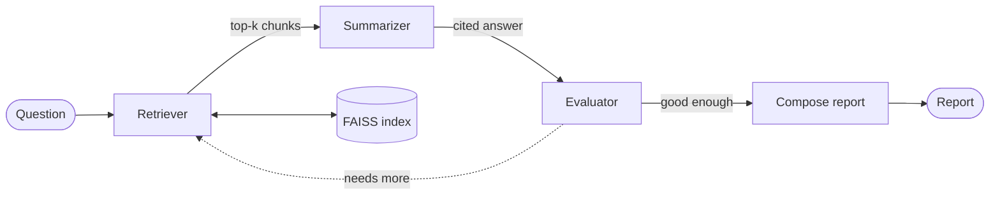

# Agentic Research Assistant

Reads a set of research papers and answers questions about them, with citations. Instead of stuffing everything into one prompt, it runs three small agents in a loop: one retrieves relevant passages, one writes a grounded answer, and one checks that answer and decides whether to go back for more evidence. Built on Claude, LangGraph, and FAISS.

[](https://github.com/bharathkumardev1/Agentic-Research-Assistant/actions/workflows/ci.yml)


**Live demo:** https://agentic-research-assistant-xzno.onrender.com/docs

That link opens an interactive API page. Hit "Try it out" on `/research`, type a question, and run it in the browser. No setup. (It's on a free host that sleeps when idle, so the first request after a while takes 30 to 60 seconds to wake up. After that it's quick.)

## Why I built it

Dumping a folder of PDFs into a single LLM call doesn't work well. It hallucinates, it misses the parts you actually care about, and you can't tell which claim came from which paper. I wanted something that behaves more like a person doing a literature review: find the relevant bits, draft an answer, then look at that draft critically and go dig up more if it's thin.

So the work is split across three agents that share one vector store:

- The **retriever** pulls the most relevant chunks for the current query.
- The **summarizer** asks Claude for an answer that uses only those chunks, and tags every factual sentence with a `[n]` pointing at its source.
- The **evaluator** is a second Claude call that grades the answer for grounding and coverage. If it's not good enough, it writes a sharper query and the whole thing loops.

A LangGraph state machine runs that loop and decides when to stop.

## How the loop works

The interesting part is the dashed arrow. The evaluator's verdict, not a fixed script, is what decides whether the system is done or goes around again.



The loop is capped by `MAX_ITERATIONS` (3 by default), so it always terminates. That cap plus a per-run limit on API calls is also what keeps a misbehaving evaluator from looping forever and running up a bill.

Step by step:

1. Documents get split by a chunker that breaks on paragraph, then sentence, then word boundaries, with a bit of overlap so context isn't cut mid-thought. Each chunk is embedded and added to FAISS.
2. For the current query, the retriever returns the top matches by cosine similarity. Across loops, new chunks are merged with what's already been found.
3. The chunks get numbered and handed to Claude, which answers using only them and marks each claim with `[n]`. The JSON that comes back is validated with Pydantic.
4. A second Claude call scores the answer. If it needs more and there's budget left, it hands back a refined query and the graph loops.
5. Once the evaluator is satisfied (or the budget runs out), everything is rendered into a Markdown report: the summary, the extracted methods, key findings, and research gaps, plus the search trail and a numbered reference list.

## Runs offline, no API key

Every piece has a fallback, so you can watch the full loop run with nothing configured:

```bash
pip install -e .
python -m research_assistant demo
```

The demo runs offline. It swaps in a deterministic hashing embedding and a stub that fakes structured output from the retrieved text. That still exercises the real retrieval, the real graph, the real citation numbering, and the real report renderer. It just doesn't call the network. Add an `ANTHROPIC_API_KEY` and you get real Claude answers instead of the stub.

## Running it locally

Needs Python 3.9 or newer.

```bash
git clone https://github.com/bharathkumardev1/Agentic-Research-Assistant.git
cd Agentic-Research-Assistant
python -m venv .venv && source .venv/bin/activate
pip install -e .
```

Point it at your own papers and ask something:

```bash
# Local files or folders (.pdf, .txt, .md), or pull from arXiv
research-assistant ingest path/to/papers/
research-assistant ingest --arxiv "retrieval augmented generation" --arxiv-max 8

research-assistant research "What methods do these papers use for grounding, and what gaps remain?"
research-assistant research "Compare their evaluation setups" -o report.md   # save to a file
research-assistant research "Compare their evaluation setups" --json          # full structured result
```

For real Claude answers, put your key in a `.env` file (copy `.env.example`) and it gets picked up automatically.

## Running the API

```bash
uvicorn research_assistant.webapp:app --reload
```

Three endpoints:

- `GET /health` returns status and whether it's running in live or offline mode. No auth, so a load balancer can poll it.
- `POST /research` runs the loop for a question.
- `GET /docs` is the interactive Swagger page.

If you set `WEB_API_KEY`, `/research` requires that value in an `X-API-Key` header. Leave it unset and the endpoint is open (fine for a local demo, not for anything public).

```bash
curl -X POST http://localhost:8000/research \
  -H "Content-Type: application/json" \
  -H "X-API-Key: your-key" \
  -d '{"question": "What are the research gaps?"}'
```

## Configuration

Everything reads from environment variables or a `.env` file. The ones you'll actually touch:

| Variable | Default | What it does |
|---|---|---|
| `ANTHROPIC_API_KEY` | (none) | Needed for real answers. Not needed for the offline demo. |
| `WEB_API_KEY` | (none) | If set, `/research` requires it in the `X-API-Key` header. |
| `SUMMARIZER_MODEL` | `claude-sonnet-4-6` | Model for the answer. |
| `EVALUATOR_MODEL` | `claude-opus-4-8` | Model for the critique. |
| `MAX_API_CALLS` | `40` | Hard ceiling on Claude calls per run. A cost guard. |
| `MAX_ITERATIONS` | `3` | Cap on retrieve/summarize/evaluate cycles. |
| `EMBEDDING_BACKEND` | `sentence-transformers` | Or `hashing` for a dependency-free offline embedder. |
| `TOP_K` | `6` | Chunks retrieved per query. |
| `LOG_LEVEL` | `INFO` | `DEBUG` for the play-by-play. |

## Deploying it

There's a `Dockerfile` and a `render.yaml`. To run it in a container:

```bash
docker build -t research-assistant .
docker run --rm -p 8000:8000 research-assistant
```

The live demo above is this image on Render's free tier, deployed straight from the `render.yaml` blueprint. Connect the repo on Render and it picks up the config on its own. Set `ANTHROPIC_API_KEY` and `WEB_API_KEY` in the dashboard (they're marked as secrets, so they never live in the repo).

## Frontend

`frontend/` is a small Vite + React app that gives the pipeline a UI: a question box, a three-stage agent rail (retrieve → draft → check), and the answer rendered with clickable `[n]` citation chips next to their source passages.

```bash
cd frontend
npm install
npm run dev
```

By default it runs entirely on baked-in demo data, no backend required. To point it at a real deployment, copy `frontend/.env.example` to `frontend/.env` and set `VITE_API_URL` (plus `VITE_API_KEY` if the backend has `WEB_API_KEY` set). The header pill and footer switch to "live api" once that's configured. The backend needs `CORS_ORIGINS` set to allow the frontend's origin (defaults to `*`, fine for a demo).

## Tests

```bash
pip install -e ".[dev]"
pytest
```

51 tests covering the chunker, schema validation, citation alignment, the hashing embedder, the FAISS store, JSON extraction and the stub client, a full offline end-to-end run through the real graph, and the web endpoints (health, auth, and a real pipeline call). Tests that need `faiss-cpu` or `langgraph` skip themselves if those aren't installed, so a minimal setup still passes. CI runs the whole thing on Python 3.9, 3.11, and 3.12.

## What this is, and what it isn't

I want to be straight about scope, because "agentic AI" gets oversold constantly.

The sample papers under `examples/sample_papers/` are synthetic. I wrote them so the demo has something to run against offline. The numbers in any sample output come from those made-up papers, not real research. The architecture, the retrieval, the citation grounding, and the agent loop are all real and run against live Claude the moment you add a key and point it at actual PDFs or an arXiv query.

It's also not a production system, and I wouldn't call it one. It's a working, deployed demo. There's no database (the FAISS index is a file), no per-user accounts, no rate limiting beyond the cost cap, no metrics or alerting, and the free host sleeps when idle. Turning this into something people depend on would mean adding most of that. What's here is the core engine, tested, containerized, logged, and reachable at a URL.

## Project layout

```
src/research_assistant/
  config.py         settings from env / .env
  schemas.py        Pydantic models used everywhere
  llm.py            Claude client (with retries + cost cap) and the offline stub
  webapp.py         FastAPI service
  cli.py            the research-assistant command
  logging_utils.py  structured logging with a per-run id
  ingestion/        loaders (pdf/text/md/arxiv) and the chunker
  rag/              embeddings and the FAISS store
  agents/           retriever, summarizer, evaluator
  graph/            the LangGraph loop
```

## License

MIT. See [LICENSE](LICENSE).
